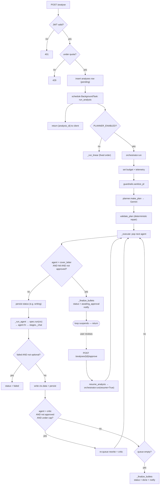
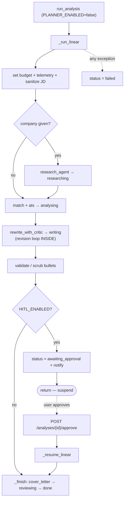

# Technical Documentation — CV Tailor

Audience: developers. This document gets you productive quickly. For the
product overview see [README.md](README.md).

---

## 1. Architecture

### Overall

A monorepo with two independently deployed apps talking to shared managed
services.

```
┌─────────────┐      HTTPS + JWT       ┌──────────────┐
│  Next.js    │ ─────────────────────► │  FastAPI     │
│  (Vercel)   │ ◄───────────────────── │  (Modal)     │
└─────┬───────┘   JSON / file blobs    └──────┬───────┘
      │                                        │
      │ supabase-js (auth, direct reads)       │ supabase-py (JWT pass-through)
      ▼                                        ▼
┌──────────────────────────────────────────────────────┐
│  Supabase: Postgres (RLS) · Auth (JWT) · Storage      │
└──────────────────────────────────────────────────────┘
                       ▲
                       │  OpenAI-compatible API + Tavily search
                ┌──────┴───────┐
                │  LLM gateway  │
                └───────────────┘
```

Key principle: **the browser authenticates with Supabase; the FastAPI backend
verifies that same JWT and passes it through to Postgres so Row-Level Security
does the tenant isolation.** The service-role key is never used on a
browser-originated request — only in the Telegram webhook path, which has no
user JWT.

### Folder structure

```
apps/
  api/                     FastAPI backend (deploys to Modal)
    app/
      main.py              app factory, CORS, /health, /auth/verify, routers
      config.py            all settings from env (pydantic-settings)
      auth.py              ES256 JWT verification via Supabase JWKS
      db.py                Supabase client factories (user vs service)
      docx_parser.py       DOCX → sections + links JSON; clean regen w/ clickable links
      pdf.py               cover letter (WeasyPrint) + CV (LibreOffice) → PDF
      telemetry.py         records LLM calls (llm_calls) + agent stages (analysis_events)
      telegram.py          bot conversation logic
      pipeline/
        stages.py          LLM wrappers (_chat/_respond) + prompts + PROMPT_VERSION
        agents.py          the specialist agents (research, analyst, ats, rewriter, critic, editor)
        tools.py           run_tool_loop + CV tools + web_search + keyword_coverage
        guardrails.py      injection scan, call budget, output validation
        worker.py          entry point; dispatches linear vs planner mode
        context.py         AnalysisContext — shared working + session memory (planner)
        registry.py        Agent Registry + Tool Registry (planner)
        planner.py         Planner Agent: structured plan + deterministic validator
        orchestrator.py    event-driven loop: run/recover, revision, HITL, persist
      routers/             profile, cv, analyse, exports, telegram_bot
    evals/                 frozen cases + scored eval runner
    tests/test_suite.py    26 offline tests
    modal_app.py           Modal deployment
    probe_gateway.py       LLM-gateway capability probe
  web/                     Next.js 14+ frontend (deploys to Vercel)
    app/                   one folder per route (App Router)
    components/            Nav, Footer, PageHeader, AnalysisResults, ApprovalPanel…
    lib/                   supabase client, api fetch wrapper, meta
    proxy.ts               auth guard (Next.js middleware/proxy)
supabase/schema.sql        tables, RLS policies, storage buckets
spikes/                    de-risk scripts (DOCX round-trip)
```

---

## 2. Backend architecture

### Request lifecycle

1. Every protected route depends on `CurrentUser` (`auth.get_current_user`),
   which reads the `Authorization: Bearer` header and verifies the JWT.
2. Handlers build a **per-request Supabase client** via `db.user_client(token)`.
   All DB and Storage calls made through it are constrained by RLS to the
   caller's rows.
3. Long work (`POST /analyse`) is enqueued as a **FastAPI BackgroundTask** and
   the endpoint returns immediately with an `analysis_id`. The client polls.

### The pipeline (the heart of the app)

The pipeline runs in one of two modes, selected by `PLANNER_ENABLED`:

- **Linear (default):** `pipeline/worker.py :: _run_linear` — a fixed-order
  state machine (described below).
- **Planner-based (opt-in):** a dynamic multi-agent system where a **Planner
  Agent** decides which specialist agents to run, in what order. See
  [docs/PLANNER_ARCHITECTURE.md](docs/PLANNER_ARCHITECTURE.md) for the full
  design, diagram, migration notes and backward-compatibility report. Both modes
  produce identical statuses/columns, so everything downstream is unchanged.

`run_analysis` is the single entry point and dispatches to whichever mode is
enabled. The linear state machine persists `status` + `agent_trace` on every
transition so the frontend can watch live:

```
pending → researching → analysing → writing → awaiting_approval
                                                     │ (user approves)
                                                     ▼
                                            reviewing → done   (or → failed)
```

Stages (in `agents.py`, each a function taking a shared `Trace`):

| Stage | What it is | LLM mechanism |
|-------|-----------|---------------|
| **Research** | employer intel + talking points, cited | tool loop (Tavily) OR hosted web_search; self-assessing |
| **Match** | 0–100 fit + gaps | **tool-using agent** (reads CV via tools, then `finish`) |
| **ATS** | keyword coverage % + missing list | hybrid: LLM extracts keywords, Python computes the score |
| **Rewrite** | new bullets, counts preserved | rewriter ⇄ **critic** loop (≤2 revisions) |
| **Cover letter** | full letter | draft + editor de-cliché pass |

### Full execution flow

End-to-end for one analysis in **planner mode** (linear mode is the same minus
the planner/registry — a fixed agent order). The client polls
`GET /analyses/{id}` throughout; every box that changes state persists
`status` + `agent_trace`, and every LLM call is logged to `llm_calls`.



Key control-flow facts encoded above: the HITL gate is enforced *in the
orchestrator* (not by the planner); the rewrite↔critic **revision loop** re-queues
agents onto the front of the queue; an **optional** agent (research) failing is
survived, an **essential** one failing fails the run cleanly; and **resume**
re-enters the same `_execute` loop with `approved=True` so the gate is skipped.

**Linear mode** (`PLANNER_ENABLED=false`, the default fallback) runs the same
agents in a fixed, hardcoded order — no planner call, no registry, no event loop.
The rewrite↔critic revision loop lives *inside* `rewrite_with_critic` rather than
being re-queued. Statuses, guardrails, HITL and outputs are identical.



### LLM call layer (`stages.py`)

**Every OpenAI call funnels through two wrappers** — nothing calls the SDK
directly:

- `_chat(label, **kwargs)` — chat completions
- `_respond(label, **kwargs)` — Responses API (hosted web_search only)

Each wrapper: spends from the call budget, times the call, sets
`model=OPENAI_MODEL`, and records tokens/latency/cost to `llm_calls`. The
`label` identifies which agent/frame the call came from.

Two higher-level conventions sit on top:

- `_structured(system, user, schema_name, schema)` — strict JSON-schema output.
  **Auto-degrades**: if the gateway 400s on strict mode, it caches that fact and
  switches to prompt-engineered JSON with lenient parsing + one retry.
- `tools.run_tool_loop(...)` — the agentic loop (below).

### The tool loop (`tools.py`)

The textbook ReAct pattern:

```
while not done and iterations < 8:
    model responds with tool_calls
    execute each; append results to the conversation
    if it calls finish(schema) → return
near the limit → nudge it to finish
if it still exhausts → SYNTHESISE the answer from gathered context (never crash)
```

Tools available to the Analyst: `list_sections`, `get_section_bullets`,
`get_profile`, `check_keywords` (deterministic). The Researcher gets
`search_web` (Tavily, capped at 6 calls/pass). `finish` is a strict-schema exit
tool that also auto-degrades on gateways that reject strict function schemas.

### Guardrails (`guardrails.py`) — four layers

1. **Input** — prompt-injection scan on the JD; matches are neutralised and the
   JD is fenced as untrusted data.
2. **Execution** — per-analysis LLM **call budget** (25, hard stop via
   contextvar); tool loop capped at 8 iterations.
3. **Output** — deterministic bullet validation: exact counts, no URLs/emails,
   no markdown/list-glyph/line-break (formatting must stay plain), length caps.
4. **Semantic** — the Critic agent (truthfulness vs the original CV).

### DOCX handling (`docx_parser.py`)

- `parse_docx` walks paragraphs **and table cells**, classifies headings vs
  bullets, and returns `{ personal, sections: [{ id, title, bullets, blocks }],
  links }`. `blocks` preserves the full ordered content (bullet / subhead / para)
  for clean regeneration; `bullets` is the rewritable subset the pipeline edits.
- **Hyperlink extraction.** `_para_links` reads real `<w:hyperlink>` elements
  (the target URL lives in the relationships, never in the run text) plus a
  regex pass for bare URLs / emails. Links are classified by host
  (`linkedin` / `github` / `portfolio` / `email` / `project` / `other`) and given
  a `scope`: **contact** (header/identity — surfaced for one-click profile
  import) or **project** (back-referenced to its `section_id` + bullet). The flat
  list is persisted to `cv_structure.links`.
- `render_cv_docx` (Option B) regenerates a clean, single-column, ATS-friendly
  DOCX from the parsed structure, substituting the rewritten bullets. Because
  links are stored **separately from the bullet prose**, the LLM rewrite cannot
  drop or mangle a URL — `render_cv_docx` re-emits each one as a **clickable**
  `<w:hyperlink>` (via `_add_hyperlink`), including a rebuilt contact line where
  LinkedIn/GitHub/Portfolio/email become live links.
- `rewrite_docx` (legacy Path A) replays the walk and edits bullets in place —
  kept for reference/tests; exports use `render_cv_docx`.

### Telemetry & context propagation

Two cross-cutting concerns (telemetry target, call budget) use **contextvars**
set once at the top of `run_analysis`, so agents never thread them through
signatures. Study `telemetry.py` and `guardrails.CallBudget` together — it's the
pattern that keeps the agent code clean.

---

## 3. Frontend architecture

### Routing & rendering

Next.js App Router. Almost all pages are client components (`"use client"`)
because they fetch per-user data and poll. `app/layout.tsx` is a server
component wrapping every page with `Nav` + `Footer`.

### Auth guard

`proxy.ts` (Next.js middleware, renamed to the `proxy` convention in Next 16)
runs on every request: it reads the Supabase session from cookies and redirects
unauthenticated users to `/login`, except for the public paths
(`/login`, `/signup`, `/reset-password`).

### Data layer

- `lib/supabase.ts` — browser Supabase client (auth + session).
- `lib/api.ts` — `api(path, init)` fetch wrapper that attaches the Supabase JWT
  to every backend call, and `apiDownload(path, filename)` for file exports.
- `lib/meta.ts` — app name/version/links (used by Footer + metadata).

### State management

Deliberately **no global state library**. Each page owns its data via
`useState`/`useEffect`; the analyser uses an interval to poll
`GET /analyses/{id}` and re-renders from the response. State that must persist
lives in Postgres, not the client.

### Component hierarchy

```
RootLayout
├── Nav                    (active-route pills, sign out)
├── <page>
│   ├── PageHeader         (title + subtitle + action — used on every screen)
│   ├── ScoreBadge         (colour-coded match/ATS score)
│   ├── AppStatus          (application-status dropdown)
│   ├── AnalysisResults    (scores, insights, bullets, letter, downloads)
│   │   ├── AgentTrace     (live agent activity / collapsible log)
│   │   └── ApiCallsDetails(per-analysis token/latency table)
│   └── ApprovalPanel      (HITL: edit bullets → approve)
└── Footer
```

---

## 4. Database

Six tables, **RLS enabled on all of them** (`user_id = auth.uid()`), plus two
storage buckets with per-user path policies.

| Table | Purpose | Notable columns |
|-------|---------|-----------------|
| `profiles` | user profile / prompt context | `bio`, `skills[]`, `additional_context`, `linkedin_url`, `github_url`, `portfolio_url` |
| `cv_structure` | parsed CV (one per user) | `sections jsonb`, `original_docx_url`, `original_filename`, `links jsonb` |
| `analyses` | one row per analysis run | `status`, `app_status`, `agent_trace`, `employer_research`, `rewritten_bullets`, `match_summary`, scores |
| `analysis_events` | per-agent execution trail (append-only) | `agent`, `stage`, `status`, `started_at`, `duration_ms` |
| `llm_calls` | telemetry (per LLM request) | `label`, `model`, `latency_ms`, tokens, `cost_usd` |
| `telegram_links` | chat_id ↔ user_id | `link_code`, `chat_id` |

`analysis_events` records **wall-clock** time per agent stage (research, match,
ats, rewrite, critic, cover_letter) — including tool loops and retries, which
`llm_calls` (per request) can't show. Written via `telemetry.record_stage`, a
context manager driven by the same contextvar as `llm_calls`, so both pipeline
modes get it with no signature plumbing.

Buckets: `cv-originals` (`{user_id}/cv_original.docx`), `exports`
(`{user_id}/{analysis_id}/…`).

---

## 5. API reference

All routes require `Authorization: Bearer <supabase_jwt>` except `/health` and
the Telegram webhook.

| Method | Path | Purpose |
|--------|------|---------|
| GET | `/health` | liveness |
| POST | `/auth/verify` | validate JWT → user_id |
| GET/POST | `/profile` | read / upsert profile |
| POST | `/cv/upload` | parse DOCX → store |
| PUT | `/cv/sections` | inline bullet edits |
| POST | `/analyse` | enqueue pipeline (quota-gated) → `{analysis_id}` |
| GET | `/analyses` | list (dashboard/history) |
| GET | `/analyses/{id}` | full analysis (polled) |
| POST | `/analyses/{id}/approve` | HITL: approve/edit bullets → resume |
| PATCH | `/analyses/{id}/status` | set application status |
| GET | `/analyses/{id}/calls` | per-analysis LLM telemetry |
| GET | `/analyses/{id}/events` | per-agent execution trail + timing |
| GET | `/quota`, `/usage` | monthly usage |
| POST | `/export/docx\|pdf\|cover-pdf/{id}` | downloads |
| POST | `/telegram/link-code` | issue a linking code |
| POST | `/telegram/webhook` | Telegram updates (secret-token auth) |

---

## 6. Authentication flow

1. User signs up / logs in via Supabase (browser).
2. Supabase issues an **ES256-signed JWT**; the browser stores the session.
3. `lib/api.ts` attaches the JWT to every backend request.
4. `auth.verify_token` fetches the **public key from Supabase's JWKS endpoint**
   and verifies signature + `aud` + `iss` + `exp` + required claims. No shared
   secret exists on the API. HS256 tokens are rejected outright.
5. The verified token is passed to `db.user_client`, so Postgres RLS enforces
   isolation.

> Requires the Supabase project to issue **asymmetric ES256** tokens (new
> projects default to this; confirm via `/auth/v1/.well-known/jwks.json`).

---

## 7. Environment & configuration

**Backend (`apps/api/.env`)**

| Var | Purpose |
|-----|---------|
| `SUPABASE_URL`, `SUPABASE_ANON_KEY` | project + anon key |
| `SUPABASE_SERVICE_ROLE_KEY` | Telegram webhook only |
| `SUPABASE_JWT_ISSUER` | override only for custom domains |
| `OPENAI_API_KEY`, `OPENAI_MODEL` | LLM credentials + model |
| `OPENAI_BASE_URL` | OpenAI-compatible gateway (e.g. OpenCode) |
| `TAVILY_API_KEY` | employer research on a gateway |
| `OPENAI_INPUT/OUTPUT_COST_PER_1M` | cost tracking |
| `MONTHLY_ANALYSIS_QUOTA`, `HITL_ENABLED` | behaviour |
| `TELEGRAM_BOT_TOKEN/WEBHOOK_SECRET/BOT_USERNAME` | bot |
| `CORS_ORIGINS` | allowed web origins |

**Frontend (`apps/web/.env.local`)**: `NEXT_PUBLIC_SUPABASE_URL`,
`NEXT_PUBLIC_SUPABASE_ANON_KEY`, `NEXT_PUBLIC_API_URL`.

---

## 8. Development workflow

- **Run tests:** `cd apps/api && py -m pytest tests/` (26 offline tests, no
  services needed — mocked LLM + fake DB).
- **Probe a gateway:** `py probe_gateway.py` — prints a capability matrix
  (chat, json_schema strict, function calling, web_search, Tavily).
- **Debug interactively:** `py -m jupyter notebook debug.ipynb` — run any agent
  stage in isolation (free and paid cells marked).
- **Evaluate quality:** `py -m evals.run [--research]` — scored runs vs frozen
  cases, tagged with `PROMPT_VERSION`, auto-diffed against the previous run.
- **Deploy backend:** `modal deploy modal_app.py`.
- **Deploy frontend:** Vercel (root `apps/web`).

---

## 9. Technical decisions & trade-offs

- **Monorepo, two deploy targets.** Next.js can't run on Modal; FastAPI wants a
  Python host. Splitting hosting keeps each on its best platform.
- **JWT pass-through + RLS** over app-level authz. Isolation is enforced in the
  database, so an application bug can't leak another tenant's data.
- **ES256-only.** No symmetric secret on the API → an API compromise cannot
  forge tokens. Also closes algorithm-confusion.
- **Postgres + jsonb, not NoSQL.** Relational needs (RLS, quotas, telemetry
  aggregation, joins) plus schemaless `jsonb` for document-shaped data — the
  hybrid a NoSQL migration would only partially achieve.
- **BackgroundTasks over Celery/Redis.** At personal scale, a status-row state
  machine is observable and recoverable enough. The seam to a real queue is
  clean if needed. *(This is also a known limitation — see §10.)*
- **Prompts in code, not the DB.** They're coupled to schemas and validators;
  git is the version manager. `PROMPT_VERSION` links quality to prompt edits.
- **Gateway-agnostic degradation.** Strict JSON and hosted web_search aren't
  universal; the code detects and falls back so it runs on any
  OpenAI-compatible endpoint.
- **Deterministic where it matters.** The ATS score and keyword coverage are
  computed in Python, not asserted by the model — they can't be hallucinated.

---

## 10. Known issues & technical debt

- **Background jobs are fire-and-forget.** If a Modal container dies mid-run,
  the row sticks in a non-terminal status and the frontend polls forever. Needs
  a poll timeout + a stuck-job sweeper.
- **Not yet run end-to-end against live services** at time of writing (Supabase
  project was unreachable). Live auth, RLS, storage, and the rewriter/cover
  letter on the production gateway are unverified.
- **No frontend tests / no CI.** Backend has 26 tests; the frontend has none and
  nothing runs them automatically.
- **`Analysis` type is duplicated** in the frontend with no shared contract with
  the backend Pydantic models — they can drift.
- **No pagination** on `/analyses` (spec'd, not built).
- **Model quality unproven.** Running on a free gateway model; rewriter/
  cover-letter quality needs an eval pass before it's relied on.
- **Accessibility gaps:** inputs use placeholders instead of labels; some
  subtle-grey text is borderline on contrast.
- **Telegram:** webhook has no rate limiting; link codes never expire.
- **No dark theme** (light-only design system).
